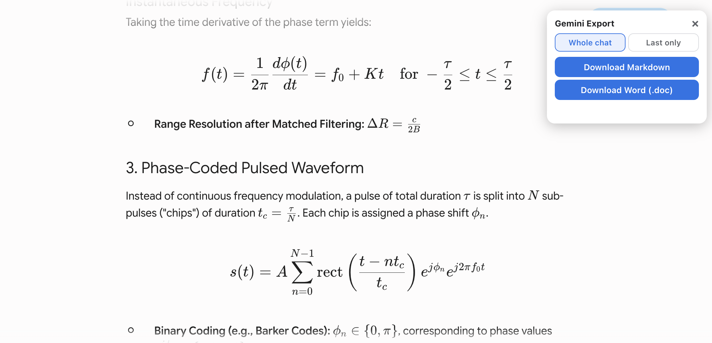
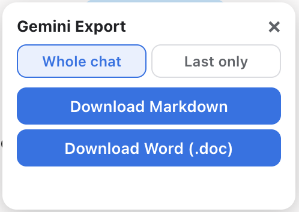

# Gemini Export

Export Google Gemini conversations — including equations — to Markdown and Word.

**➤ [Download the ready-to-run tool](https://github.com/jfluhler/gemini-export/releases/latest/download/gemini-export-tool.zip)** (zip, no install) — or see all [Releases](https://github.com/jfluhler/gemini-export/releases). Unzip, open `install.html` and `md2docx.html` in your browser.

<p align="center">
  
</p>

## Two pieces

**1. Bookmarklet** (this folder) — a button you add to your browser's bookmarks bar.
On a `gemini.google.com` conversation it shows a small panel with a scope toggle
(Whole chat / Last only) and two downloads:
- **Markdown** — pristine LaTeX (`$…$` / `$$…$$`), read from Gemini's `data-math` source.
- **Word (.doc)** — opens in Word/Pages with equations shown.

<p align="center">
  
</p>

To install: open **`install.html`** and drag the **⬇️ Gemini Export** button to your bookmarks bar.

**2. `md2docx/` app** — a self-contained `md2docx.html`. Double-click it, drag a `.md`
file on, and it downloads a real **`.docx` with native, editable equations**. Runs
entirely on-device (no upload, no install). This is where native-equation `.docx`
conversion lives, because Gemini's CSP blocks the in-page math engine the bookmarklet
would otherwise need.

**Typical workflow:** bookmarklet → *Download Markdown* → drop the `.md` on `md2docx.html` → `.docx`
(open in Word, or in Pages via File → Open).

## Layout

```
.                     bookmarklet source + built artifacts
├── gemini-export.js  bookmarklet source (edit here)
├── build.js          builds bookmarklet.txt + install.html
├── install.html      drag-to-install page   (generated)
├── bookmarklet.txt   raw javascript: URL     (generated)
├── md2docx/          the Markdown → .docx app
│   ├── app-core.js   conversion pipeline (LaTeX → KaTeX MathML → OMML → .docx zip)
│   ├── build-app.js  bundles KaTeX + marked + app-core into one HTML file
│   └── md2docx.html  the app                (generated)
└── test/             self-tests / validation harnesses
```

## Build & test

```
npm install          # first time (installs katex, marked, jsdom, linkedom)
npm run build        # rebuild bookmarklet + app
npm test             # execute the shipped md2docx.html in a headless DOM
```

## Disclaimer

This project is provided as an educational **example of client-side DOM
extraction** and document conversion. It is not affiliated with, endorsed by,
or connected to Google, and "Gemini" is a trademark of its respective owner.

You are solely responsible for how you use it. Ensure your use complies with
all applicable laws and with the terms of service of any website you run it
against (including Google Gemini's Terms of Service). Only export content you
have the right to access and use.

The software is provided "as is", without warranty of any kind — see
[LICENSE](LICENSE).
